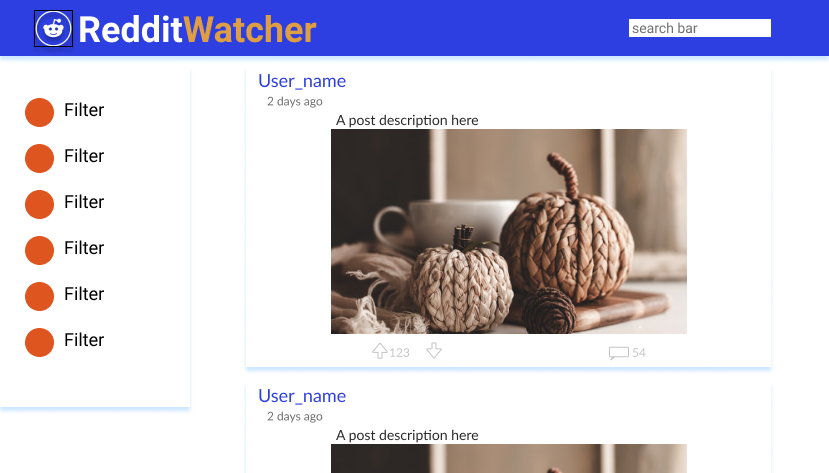
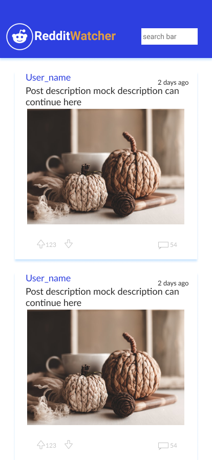
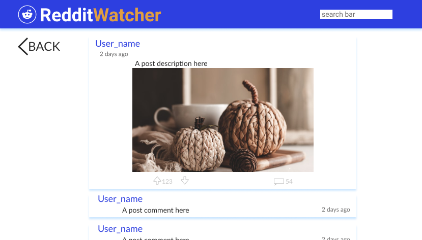
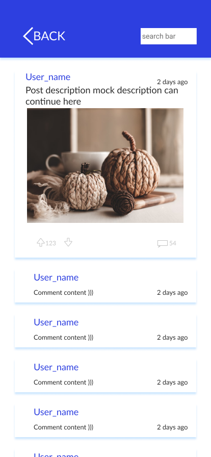

# Reddit Watcher (The Reddit client portfolio app)

This site is available on this [url](https://redditwatcher.netlify.app)

## Technologies used

This project was bootstrapped with [Create React App](https://github.com/facebook/create-react-app), using the [Redux](https://redux.js.org/) and [Redux Toolkit](https://redux-toolkit.js.org/) template.

## Features

- Search for a subreddit
- Filter subreddits by the build-in subreddit filter
- Read posts with text, photo, video or gif
- Read comments and nested comments
- User friendly UI

## Future work

- Migration from JSON API to OAuth API
- Dark mode
- Advanced searching
- Mobile app

## Wireframes

Main page
&ensp;

&ensp;

Mobile main page
&ensp;

&ensp;

Post page
&ensp;

&ensp;

Mobile post page
